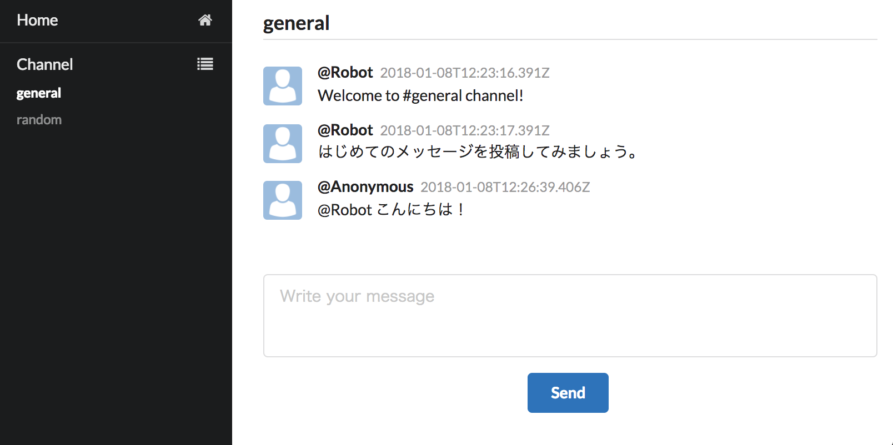

# 第6章 React 入門 & 徹底活用サンプルコード

「第6章 React 入門 & 徹底活用」で解説しているソースコードのサンプルコードを公開しています。

**依存パッケージのバージョンアップにともない、書籍の内容ではエラーが発生するという issue を報告いただいたため ([#20](https://github.com/okachijs/jsframeworkbook/pull/20))、依存パッケージのバージョンを更新しています。**

## サンプルアプリケーション完成後のイメージ



## Directory Structures

ディレクトリ構造は以下のとおりです。

```
├── README.md
├── package-lock.json
├── package.json
├── src
│   ├── Routes.tsx
│   ├── client.ts
│   ├── components
│   └── containers
├── src_making
│   ├── v0.1
│   ├── v0.2
│   ├── v0.3
│   ├── v0.4
│   ├── v0.5
│   └── v0.9
├── tsconfig.json
├── tslint.json
└── webpack.config.js
```

Directory | Description
:-------: | -----------
src | 完成後のアプリケーションのソースコードです
src_making | 完成前のアプリケーションのソースコードです
src_making/v0.1 | p83「チャンネル一覧 Component の実装」
src_making/v0.2 | p85「Routing設定 Component の実装」
src_making/v0.3 | p88「メッセージフィード Component の実装」
src_making/v0.4 | p94「メッセージフォーム Component の実装」
src_making/v0.5 | p99「Component間の連携」
src_making/v0.9 | v0.5 までの内容をまとめたもの

## npm Commands

ディレクトリ `3_6_react` に移動し、npm コマンドを実行します。

依存パッケージ をインストールするには以下のコマンドを実行します。

```bash
npm i
```

`webpack-dev-server` を起動するには以下のコマンドを実行します。

```bash
npm run start
```

アプリケーションをビルドするには以下のコマンドを実行します。

```bash
npm run build
```

## 正誤表

正誤表については下記をご参照ください。

* [誤植訂正情報 · okachijs/jsframeworkbook Wiki](https://github.com/okachijs/jsframeworkbook/wiki/%E8%AA%A4%E6%A4%8D%E8%A8%82%E6%AD%A3%E6%83%85%E5%A0%B1)
